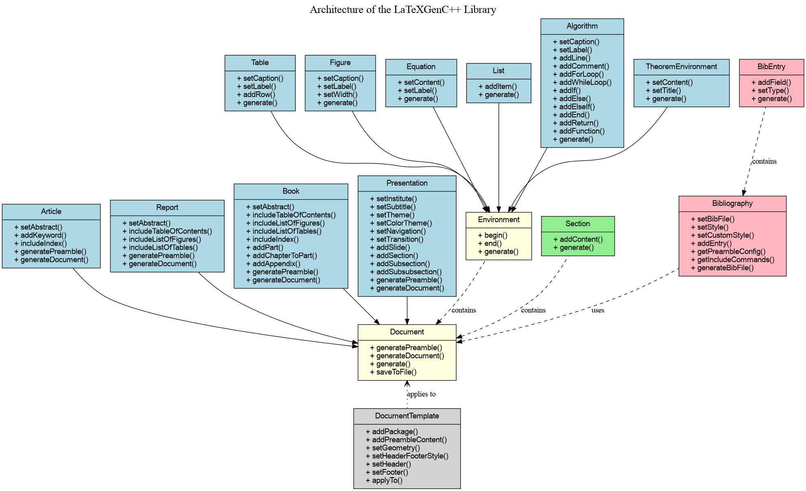

# LatexGenC++ - Detailed Documentation

## Table of Contents

1. [Introduction](#introduction)
2. [Library Architecture](#library-architecture)
3. [Document Types](#document-types)
   - [Article](#article)
   - [Report](#report)
   - [Book](#book)
   - [Presentation](#presentation)
4. [Content Structure](#content-structure)
   - [Sections, Subsections and Paragraphs](#sections-subsections-and-paragraphs)
   - [Chapters and Parts](#chapters-and-parts)
   - [Appendices](#appendices)
5. [Content Elements](#content-elements)
   - [Text and Formatting](#text-and-formatting)
   - [Lists](#lists)
   - [Tables](#tables)
   - [Figures](#figures)
   - [Equations](#equations)
   - [Theorems](#theorems)
   - [Algorithms](#algorithms)
6. [Bibliography](#bibliography)
   - [Using an External .bib File](#using-an-external-bib-file)
   - [Manual Creation of Bibliography Entries](#manual-creation-of-bibliography-entries)
   - [Bibliography Styles](#bibliography-styles)
   - [Citations](#citations)
7. [Index](#index)
8. [Multilingual Support](#multilingual-support)
9. [Advanced Customization](#advanced-customization)
   - [Document Templates](#document-templates)
   - [Packages and Preamble](#packages-and-preamble)
10. [Complete Examples](#complete-examples)
11. [API Reference](#api-reference)
12. [Troubleshooting](#troubleshooting)
13. [Document Compilation](#document-compilation)

## Introduction

LatexGenC++ is a C++ library that enables programmatic generation of LaTeX documents. The library offers an object-oriented approach to create different types of LaTeX documents, including scientific articles, technical reports, books, and Beamer presentations.

The main objective of LatexGenC++ is to simplify the creation of LaTeX documents using C++ code, which is particularly useful in cases where document content needs to be dynamically generated from data or calculations.

## Library Architecture

LatexGenC++ is designed using an object-oriented architecture, with a class hierarchy that reflects the different types of LaTeX documents and elements.

The base `Document` class defines the common interface for all document types, while derived classes such as `Article`, `Report`, `Book`, and `Presentation` implement functionality specific to each document type.

Content elements like tables, figures, equations, etc., are managed by classes derived from the base `Environment` class.



## Document Types

### Article

The `Article` class corresponds to the LaTeX `article` document type. It is suitable for scientific articles, short documents, and academic publications.

```cpp
// Creating an article
Article article("Document Title", "Author Name", "Date");

// Adding an abstract
article.setAbstract("This is the abstract of the article...");

// Adding keywords
article.addKeyword("LaTeX");
article.addKeyword("C++");
```

### Report

The `Report` class corresponds to the LaTeX `report` document type. It is designed for longer documents with chapters, such as technical reports or theses.

```cpp
// Creating a report
Report report("Report Title", "Author Name", "Date");

// Enabling table of contents
report.includeTableOfContents(true);

// Enabling lists of figures and tables
report.includeListOfFigures(true);
report.includeListOfTables(true);
```

### Book

The `Book` class corresponds to the LaTeX `book` document type. It is intended for voluminous documents with parts, chapters, and various front and back matter elements.

```cpp
// Creating a book
Book book("Book Title", "Author Name", "Date");

// Adding a part
book.addPart("First Part");

// Adding a chapter to a part (index 0 = first part)
Section chapter("Chapter 1", Section::Level::CHAPTER);
book.addChapter(chapter, 0);

// Adding an appendix
Section appendix("Appendix A", Section::Level::CHAPTER);
book.addAppendix(appendix);
```

### Presentation

The `Presentation` class corresponds to the LaTeX `beamer` document type. It allows you to create presentations for conferences or lectures.

```cpp
// Creating a presentation
Presentation presentation("Presentation Title", "Author Name", "Date");

// Configuring the theme
presentation.setTheme(PresentationTheme::MADRID);
presentation.setColorTheme(PresentationColorTheme::BEAVER);
presentation.setTransition(PresentationTransition::FADE);

// Adding a slide
auto slide = std::make_shared<Slide>("Slide Title");
slide->addContent("Slide Content");
presentation.addSlide(slide);

// Creating the structure (true = create a slide for this section)
presentation.addSection("Introduction", true);
presentation.addSubsection("Context", false);
```

## Content Structure

### Sections, Subsections and Paragraphs

The `Section` class allows you to create sections, subsections, and subsubsections in documents.

```cpp
// Creating a section
Section section("Section Title", Section::Level::SECTION);

// Creating a subsection
Section subsection("Subsection Title", Section::Level::SUBSECTION);

// Creating a subsubsection
Section subsubsection("Subsubsection Title", Section::Level::SUBSUBSECTION);

// Adding content to a section
section.addContent("Section text...");

// Adding a subsection to a section
section.addContent(subsection.generate());

// Adding the section to the document
document.addSection(section);
```

### Chapters and Parts

For reports and books, you can use chapters and parts.

```cpp
// Creating a chapter
Section chapter("Chapter Title", Section::Level::CHAPTER);

// For books, you can organize chapters into parts
book.addPart("Part Title");
book.addChapter(chapter, 0); // Adds the chapter to the first part
```

### Appendices

Appendices are available for reports and books.

```cpp
// Creating an appendix
Section appendix("Appendix Title", Section::Level::CHAPTER);

// Adding the appendix to the document
book.addAppendix(appendix);
// or
report.addAppendix(appendix);
```

## Content Elements

### Text and Formatting

You can add formatted text to sections using the `addContent` method.

```cpp
// Adding plain text
section.addContent("Normal text.");

// Adding text with LaTeX commands
section.addContent("Text in \\textbf{bold} and in \\textit{italic}.");

// Adding raw LaTeX content
document.addRawContent("\\clearpage");
```

### Lists

The `List` class allows you to create different types of lists.

```cpp
// Creating a bulleted list
auto itemize = std::make_shared<List>(List::ListType::ITEMIZE);
itemize->addItem("First item");
itemize->addItem("Second item");

// Creating a numbered list
auto enumerate = std::make_shared<List>(List::ListType::ENUMERATE);
enumerate->addItem("Step 1");
enumerate->addItem("Step 2");

// Creating a description list
auto description = std::make_shared<List>(List::ListType::DESCRIPTION);
description->addItem("Term 1", "Definition 1");
description->addItem("Term 2", "Definition 2");

// Adding the list to a section
section.addContent(itemize->generate());
```

You can also use the convenience methods provided by document classes:

```cpp
// Using the addList method
auto list = document.addList(List::ListType::ITEMIZE);
list->addItem("Item 1");
list->addItem("Item 2");
```

### Tables

The `Table` class allows you to create tables with headers and content.

```cpp
// Creating column headers
std::vector<std::string> headers = {"Column 1", "Column 2", "Column 3"};

// Creating the table
auto table = std::make_shared<Table>(headers);
table->setCaption("Table Caption");
table->setLabel("tab:example");

// Adding rows
table->addRow({"Value 1.1", "Value 1.2", "Value 1.3"});
table->addRow({"Value 2.1", "Value 2.2", "Value 2.3"});

// Adding the table to a section
section.addContent(table->generate());
```

You can also use the convenience method:

```cpp
// Using the addTable method
auto table = document.addTable(
    headers,                  // Column headers
    "Table Caption",          // Caption
    "tab:example",            // Label for reference
    "htbp"                    // Position
);

// Adding rows
table->addRow({"Value 1.1", "Value 1.2", "Value 1.3"});
```

### Figures

The `Figure` class allows you to insert images into documents.

```cpp
// Creating a figure
auto figure = std::make_shared<Figure>("path/to/image.png");
figure->setCaption("Figure Caption");
figure->setLabel("fig:example");
figure->setWidth("0.7\\textwidth");

// Adding the figure to a section
section.addContent(figure->generate());
```

You can also use the convenience method:

```cpp
// Using the addFigure method
auto figure = document.addFigure(
    "path/to/image.png",         // Image path
    "Figure Caption",            // Caption
    "fig:example",               // Label for reference
    "0.7\\textwidth",            // Width
    "htbp"                       // Position
);
```

### Equations

The `Equation` class allows you to add mathematical equations.

```cpp
// Creating an equation
auto equation = std::make_shared<Equation>("E = mc^2");
equation->setLabel("eq:einstein");
equation->setNumbered(true);

// Adding the equation to a section
section.addContent(equation->generate());
```

You can also use the convenience methods:

```cpp
// Using the addEquation method
auto equation = document.addEquation(
    "E = mc^2",             // Equation content
    "eq:einstein",          // Label for reference
    true                    // Numbered equation
);

// Adding an inline equation
std::string inlineEq = document.addInlineEquation("F = ma");
document.addRawContent("The formula " + inlineEq + " is Newton's second law.");
```

### Theorems

The `TheoremEnvironment` class allows you to create theorem environments.

```cpp
// Creating a theorem
auto theorem = document.addTheorem(
    TheoremEnvironment::Type::THEOREM,     // Theorem type
    "A + B = B + A",                       // Theorem content
    "Commutativity of Addition"            // Theorem title (optional)
);
```

Different theorem types are available:
- `THEOREM`: Theorem
- `LEMMA`: Lemma
- `COROLLARY`: Corollary
- `PROPOSITION`: Proposition
- `DEFINITION`: Definition
- `EXAMPLE`: Example
- `REMARK`: Remark
- `PROOF`: Proof

### Algorithms

The `Algorithm` class allows you to create formatted algorithm descriptions.

```cpp
// Creating an algorithm
auto algorithm = document.addAlgorithm(
    "Bubble Sort",          // Caption
    "algo:bubblesort"       // Label
);

// Configuring the algorithm
algorithm->addFunction("BubbleSort", "A : array of integers");
algorithm->addForLoop("i = 1 \\textbf{to} size(A)", 1);
algorithm->addForLoop("j = 1 \\textbf{to} size(A) - i", 2);
algorithm->addIf("A[j] > A[j+1]", 3);
algorithm->addLine("swap A[j] and A[j+1]", 4);
algorithm->addEnd("If", 3);
algorithm->addEnd("For", 2);
algorithm->addEnd("For", 1);
algorithm->addReturn("A", 1);
algorithm->addFunctionEnd(0);
```

## Bibliography

LatexGenC++ offers two approaches for managing bibliographies:

### Using an External .bib File

This approach uses an existing .bib file:

```cpp
// Creating a bibliography from an external file
Bibliography biblio("references", BibStyle::IEEE);

// Adding the bibliography to the document
document.setBibliography(biblio);

// Adding a citation
document.addRawContent("According to " + document.cite("smith2023") + ", the theory is valid.");
```

### Manual Creation of Bibliography Entries

This approach allows you to create references programmatically:

```cpp
// Creating an empty bibliography
Bibliography biblio;
biblio.setStyle(BibStyle::IEEE);

// Creating an article entry
BibEntry articleEntry("smith2023", BibEntry::EntryType::ARTICLE);
articleEntry.addField("author", "John Smith");
articleEntry.addField("title", "Introduction to LaTeX Programming");
articleEntry.addField("journal", "Journal of Document Engineering");
articleEntry.addField("year", "2023");
articleEntry.addField("volume", "42");
articleEntry.addField("number", "1");
articleEntry.addField("pages", "123--456");

// Adding the entry to the bibliography
biblio.addEntry(articleEntry);

// Creating a book entry
BibEntry bookEntry("johnson2022", BibEntry::EntryType::BOOK);
bookEntry.addField("author", "Mark Johnson");
bookEntry.addField("title", "Advanced Document Engineering");
bookEntry.addField("publisher", "Technical Publishing House");
bookEntry.addField("year", "2022");
bookEntry.addField("address", "New York");

// Adding the entry to the bibliography
biblio.addEntry(bookEntry);

// Generating the .bib file
biblio.generateBibFile("output");

// Using the bibliography in the document
document.setBibliography(biblio);

// Adding citations
document.addRawContent("According to " + document.cite("smith2023") + ", the theory is valid.");
document.addRawContent("For more details, see " + document.cite("johnson2022") + ".");
```

### Bibliography Styles

LatexGenC++ supports several common bibliography styles:

- `BibStyle::PLAIN`: Plain style
- `BibStyle::ALPHA`: Alphanumeric style
- `BibStyle::ABBRV`: Abbreviated style
- `BibStyle::IEEE`: IEEE style
- `BibStyle::ACM`: ACM style
- `BibStyle::APA`: APA style
- `BibStyle::CHICAGO`: Chicago style

You can also define a custom style:

```cpp
biblio.setCustomStyle("custom-style-name");
```

### Citations

Several citation methods are available:

```cpp
// Standard citation
document.addRawContent("See " + document.cite("smith2023") + ".");

// Author citation
document.addRawContent("As indicated in " + document.citeAuthor("smith2023") + ".");

// Year citation
document.addRawContent("This theory was developed in " + document.citeYear("smith2023") + ".");

// Citation with multiple references
document.addRawContent("See " + document.cite({"smith2023", "johnson2022"}) + ".");
```

## Index

LatexGenC++ allows you to create indexes to facilitate navigation in documents.

```cpp
// Enabling the index
document.includeIndex(true);

// Adding index entries in the content
section.addContent("This is an example of indexing. \\index{Indexing}");

// Entry with sub-entry
section.addContent("LaTeX is powerful. \\index{LaTeX!Power}");

// Entry with formatting
section.addContent("Index formatting. \\index{Formatting|textbf}");

// Entry with cross-reference
section.addContent("Cross-reference. \\index{Reference|see{Cross-reference}}");
```

To compile the document with an index, run the following commands:
```
pdflatex document.tex
makeindex document.idx
pdflatex document.tex
```

## Multilingual Support

LatexGenC++ supports 11 different languages:

- `Language::ENGLISH`: English
- `Language::FRENCH`: French
- `Language::GERMAN`: German
- `Language::SPANISH`: Spanish
- `Language::ITALIAN`: Italian
- `Language::PORTUGUESE`: Portuguese
- `Language::DUTCH`: Dutch
- `Language::RUSSIAN`: Russian
- `Language::JAPANESE`: Japanese
- `Language::CHINESE`: Chinese
- `Language::ARABIC`: Arabic

Specify the language when creating the document:

```cpp
// Creating a document in French
Article article("Title", "Author", "Date", Language::FRENCH);
```

## Advanced Customization

### Document Templates

Templates allow you to apply a consistent style to multiple documents:

```cpp
// Creating a template
DocumentTemplate academicTemplate("Academic");
academicTemplate.setGeometry("margin=2.5cm");
academicTemplate.setHeaderFooterStyle("fancy");
academicTemplate.setHeader("", "\\thetitle", "\\thepage");
academicTemplate.setFooter("\\theauthor", "", "\\today");
academicTemplate.addPackage("microtype");

// Applying the template to the document
academicTemplate.applyTo(document);
```

### Packages and Preamble

You can customize the LaTeX preamble:

```cpp
// Adding packages
document.addPackage("listings");
document.addPackage("xcolor");
document.addPackage("graphicx");

// Adding configuration in the preamble
document.addInPreamble("\\lstset{\n"
                       "  basicstyle=\\small\\ttfamily,\n"
                       "  keywordstyle=\\color{blue}\\bfseries,\n"
                       "  commentstyle=\\color{green!60!black}\\itshape\n"
                       "}");
```

## Complete Examples

Complete examples are available in the `examples/` directory:

- `article_example.cpp`: Example of a scientific article
- `report_example.cpp`: Example of a technical report
- `book_example.cpp`: Example of a book
- `presentation_example.cpp`: Example of a Beamer presentation
- `index_example.cpp`: Example of index usage
- `multilingual_example.cpp`: Example of a multilingual document

## API Reference

For detailed API documentation, see the header file `include/latexgen.h`.

## Troubleshooting

### LaTeX Compilation Issues

If you encounter problems when compiling the generated LaTeX documents:

1. Check that LaTeX is properly installed on your system
2. Make sure all necessary packages are installed
3. Check the LaTeX log file for detailed information about errors

### Character Encoding

For documents with special or non-ASCII characters:

```cpp
// Adding support for UTF-8 encoding
document.addPackage("inputenc", "utf8");
document.addPackage("fontenc", "T1");
```

### Figure Issues

If figures do not display correctly:

1. Check that the path to the images is correct
2. Make sure the image format is supported by LaTeX (prefer PDF, PNG, or JPG)
3. Add the `graphicx` package by including `document.addPackage("graphicx");` in your code

### Bibliography Compilation Issues

If you encounter errors when compiling with bibliography:

1. Make sure to run `pdflatex`, then `bibtex`, then `pdflatex` twice
2. Check that citation keys in the document match the keys in the .bib file
3. Check the syntax of bibliography entries, particularly braces and quotes

## Document Compilation

To compile a LaTeX document generated with bibliography and index:

```bash
# First compilation
pdflatex document.tex

# Bibliography processing
bibtex document

# Index processing (if used)
makeindex document.idx

# Additional compilations to resolve references
pdflatex document.tex
pdflatex document.tex
```


If you have additional questions or wish to contribute to the development of this library, feel free to consult the project repository or contact the author.